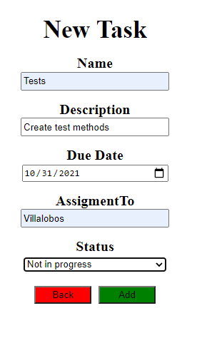
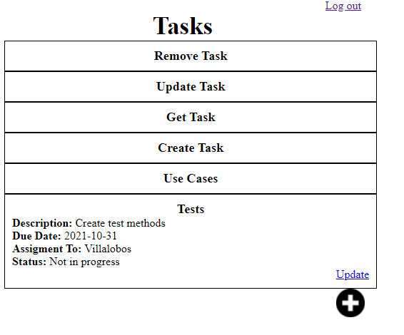

# LAB-6-YARIT-VILLALOBOS

### Descripción:

Frontend de una aplicación para agregar nuevas tareas, consultarlas y actualizarlas hecha en React.

### Login (/ o /login)

Al oprimir el boton "Login" lo llevara para "/Home"

### View Tasks (/Home)

En /Home se encuentran las tareas existentes, la manera de consultar las Tareas es oprimiendo encima de la tarea y esta desplegara.

Desplegando las tareas para verlas.

### Add New Task (/Task_form)

En el boton de "+" de /Home es para crear una nueva tarea.

Se creo una tarea llamada "Tasks", completando los campos que se pedian y oprimiendo el botón "Add", al oprimirlo creaba la tarea y nos devolvia a "/Home".

Y se comprobo que se haya creado la tarea.

### Add Update Task (/Task_form/{name_task}) en este caso /Task_form/Tests

Cada tarea al desplegarla tiene el boton de "update", para actualizar la tarea

al oprimirlo aparece la ventana con los datos de la tarea y se cambia el dato que quiere, en este caso se cambio el Status que estaba en "Not in Progress" por "In progress" 

Y por último se confirmaron los cambios

### Autores:

* Yarit Yajanny Villalobos Jimenez
